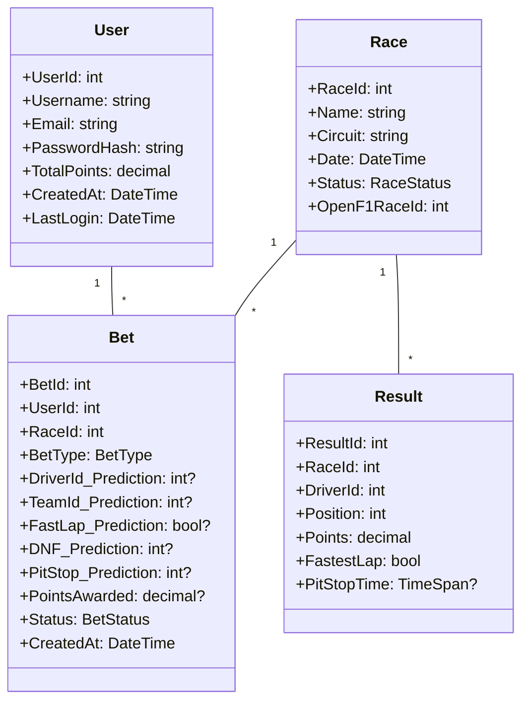

# F1 Betting Game - Technical Implementation Plan

## Table of Contents
1. [Overview](#1-overview)
2. [Current Architecture Analysis](#2-current-architecture-analysis)
3. [Implementation Strategy](#3-implementation-strategy)
4. [Component Breakdown](#4-component-breakdown)
5. [Integration Points](#5-integration-points)
6. [Potential Conflicts & Resolution](#6-potential-conflicts--resolution)
7. [Migration Plan](#7-migration-plan)
8. [Testing Strategy](#8-testing-strategy)
9. [Deployment Considerations](#9-deployment-considerations)

## 1. Overview

This document outlines the technical implementation plan for the F1 Betting Game based on the comprehensive specification. It considers the existing codebase structure, identifies integration points, and addresses potential conflicts between the current implementation and the new requirements.

## 2. Current Architecture Analysis

### 2.1 Existing Structure

The current codebase follows a Clean Architecture pattern with the following layers:

- **Presentation Layer**: ASP.NET Core Web API (F1BettingApp.API)
- **Application Layer**: Business logic (F1BettingApp.Application)
- **Domain Layer**: Core entities and enums (F1BettingApp.Domain)
- **Infrastructure Layer**: Data access and external integrations (F1BettingApp.Infrastructure)

### 2.2 Key Observations

1. **Domain Model**: Current `Bet` entity is simplified (only driver-based bets)
2. **OpenF1 Integration**: Basic client exists but needs expansion
3. **Background Jobs**: Directory exists but no implementation found
4. **Database Schema**: Current schema (db_schema.puml) is more complex than needed for virtual points system
5. **Authentication**: Basic structure in place but needs JWT implementation

### 2.3 Gaps vs Specification

| Requirement | Current Status | Gap |
|-------------|----------------|-----|
| Multiple bet types | Single driver-based bet | Need to support 9+ bet types |
| Virtual points system | Not implemented | Need wallet/transaction system |
| Race result processing | Not implemented | Need background jobs |
| Leaderboards | Not implemented | Need ranking system |
| Real-time updates | Not implemented | Need signalR/websocket |
| OpenF1 data sync | Basic client | Need comprehensive sync |

## 3. Implementation Strategy

### 3.1 Phased Approach

**Phase 1: Core Infrastructure (2-3 weeks)**
- Enhance OpenF1 integration
- Implement background job system
- Build virtual points/wallet system
- Create comprehensive bet types

**Phase 2: Betting Functionality (3-4 weeks)**
- Implement all bet types
- Build bet placement/cancellation
- Create result processing engine
- Develop leaderboard system

**Phase 3: User Experience (2-3 weeks)**
- Real-time updates (SignalR)
- Notification system
- Admin dashboard
- Mobile responsiveness

### 3.2 Architectural Decisions

1. **Database**: Use simplified schema optimized for virtual points (not full bookmaker schema)
2. **Background Jobs**: Implement using Hangfire for reliability
3. **Real-time**: Use SignalR for live updates
4. **Caching**: Redis for OpenF1 data and odds
5. **Authentication**: JWT with refresh tokens

## 4. Component Breakdown

### 4.1 Enhanced Domain Model

#### 4.1.1 Core Entities



#### 4.1.2 Enums

```csharp
// BetType.cs
public enum BetType
{
    Top3Drivers,
    RaceWinner,
    PodiumFinishers,
    Top10Finishers,
    FastestLap,
    FastestPitStop,
    NumberOfDNFs,
    DriverVsDriver,
    TeamVsTeam
}

// RaceStatus.cs
public enum RaceStatus
{
    Scheduled,
    InProgress,
    Finished,
    ResultsProcessed
}

// BetStatus.cs
public enum BetStatus
{
    Pending,
    Won,
    Lost,
    Cancelled,
    PartialWin
}
```

### 4.2 Service Layer Enhancements

#### 4.2.1 IBettingService (Enhanced)

```csharp
public interface IBettingService
{
    // Current methods
    Task PlaceBetAsync(int userId, int raceId, BetType betType, Dictionary<string, object> predictions, decimal amount);
    Task CancelBetAsync(int betId);
    Task<IEnumerable<BetDto>> GetUserBetsAsync(int userId);

    // New methods
    Task<IEnumerable<BetTypeDto>> GetAvailableBetTypesAsync(int raceId);
    Task<decimal> CalculateOddsAsync(int raceId, BetType betType, Dictionary<string, object> predictions);
    Task ProcessRaceResultsAsync(int raceId);
    Task<IEnumerable<BetDto>> GetActiveBetsForRaceAsync(int raceId);
}
```

#### 4.2.2 New Services

```csharp
// IRaceService.cs
public interface IRaceService
{
    Task SyncRaceCalendarAsync();
    Task SyncRaceDetailsAsync(int raceId);
    Task SyncRaceResultsAsync(int raceId);
    Task<IEnumerable<RaceDto>> GetUpcomingRacesAsync();
    Task<RaceDto> GetRaceDetailsAsync(int raceId);
    Task UpdateRaceStatusAsync(int raceId, RaceStatus status);
}

// ILeaderboardService.cs
public interface ILeaderboardService
{
    Task<IEnumerable<UserRankingDto>> GetGlobalLeaderboardAsync(int limit = 100);
    Task<IEnumerable<UserRankingDto>> GetLeaderboardForSeasonAsync(int seasonId, int limit = 100);
    Task<UserRankingDto> GetUserRankingAsync(int userId);
    Task UpdateLeaderboardAsync(int raceId);
    Task<IEnumerable<UserRankingDto>> GetLeaderboardHistoryAsync(int userId);
}

// INotificationService.cs
public interface INotificationService
{
    Task SendBetResultNotificationAsync(int betId, BetStatus status, decimal? pointsAwarded);
    Task SendRaceReminderAsync(int raceId);
    Task SendLowBalanceWarningAsync(int userId);
    Task<IEnumerable<NotificationDto>> GetUserNotificationsAsync(int userId);
    Task MarkNotificationAsReadAsync(int notificationId);
}
```

### 4.3 Infrastructure Layer

#### 4.3.1 OpenF1 Client Enhancement

```csharp
public class OpenF1Client
{
    private readonly HttpClient _httpClient;
    private readonly ILogger<OpenF1Client> _logger;
    private readonly ICacheService _cacheService;

    public OpenF1Client(HttpClient httpClient, ILogger<OpenF1Client> logger, ICacheService cacheService)
    {
        _httpClient = httpClient;
        _logger = logger;
        _cacheService = cacheService;
        _httpClient.BaseAddress = new Uri("https://api.openf1.org/v1/");
        _httpClient.Timeout = TimeSpan.FromSeconds(30);
    }

    public async Task<IEnumerable<RaceDto>> GetRacesAsync(DateTime? fromDate = null)
    {
        var cacheKey = $"openf1:races:{fromDate?.ToString("yyyy-MM-dd")}";
        var cachedData = await _cacheService.GetAsync<IEnumerable<RaceDto>>(cacheKey);

        if (cachedData != null) return cachedData;

        try
        {
            var response = await _httpClient.GetAsync("races" + (fromDate != null ? $"?date>{fromDate:yyyy-MM-dd}" : ""));
            response.EnsureSuccessStatusCode();

            var data = await response.Content.ReadFromJsonAsync<OpenF1RaceResponse[]>();
            var mapped = data.Select(MapToRaceDto).ToList();

            await _cacheService.SetAsync(cacheKey, mapped, TimeSpan.FromHours(1));
            return mapped;
        }
        catch (Exception ex)
        {
            _logger.LogError(ex, "Failed to fetch races from OpenF1 API");
            return cachedData ?? Array.Empty<RaceDto>();
        }
    }

    // Additional methods for standings, results, drivers, teams, etc.
}
```

#### 4.3.2 Background Jobs Implementation

```csharp
// RaceStatusMonitorJob.cs
public class RaceStatusMonitorJob : IRecurringJob
{
    private readonly IRaceService _raceService;
    private readonly IOpenF1Client _openF1Client;
    private readonly ILogger<RaceStatusMonitorJob> _logger;

    public RaceStatusMonitorJob(IRaceService raceService, IOpenF1Client openF1Client, ILogger<RaceStatusMonitorJob> logger)
    {
        _raceService = raceService;
        _openF1Client = openF1Client;
        _logger = logger;
    }

    public async Task Execute()
    {
        _logger.LogInformation("Starting race status monitor job");

        try
        {
            // Get upcoming races that haven't been processed yet
            var upcomingRaces = await _raceService.GetUpcomingRacesAsync();

            foreach (var race in upcomingRaces)
            {
                try
                {
                    // Check current status from OpenF1
                    var currentStatus = await _openF1Client.GetRaceStatusAsync(race.OpenF1RaceId);

                    if (currentStatus == RaceStatus.Finished && race.Status != RaceStatus.ResultsProcessed)
                    {
                        _logger.LogInformation("Race {RaceId} has finished, triggering result processing", race.RaceId);
                        await _raceService.UpdateRaceStatusAsync(race.RaceId, RaceStatus.Finished);

                        // Trigger result processing job
                        BackgroundJob.Enqueue<ResultProcessingJob>(job => job.ProcessRaceResults(race.RaceId));
                    }
                }
                catch (Exception ex)
                {
                    _logger.LogError(ex, "Error processing race {RaceId}", race.RaceId);
                }
            }
        }
        catch (Exception ex)
        {
            _logger.LogError(ex, "Race status monitor job failed");
        }
    }
}

// ResultProcessingJob.cs
public class ResultProcessingJob : IJob
{
    private readonly IBettingService _bettingService;
    private readonly IRaceService _raceService;
    private readonly ILeaderboardService _leaderboardService;
    private readonly INotificationService _notificationService;
    private readonly ILogger<ResultProcessingJob> _logger;

    public ResultProcessingJob(
        IBettingService bettingService,
        IRaceService raceService,
        ILeaderboardService leaderboardService,
        INotificationService notificationService,
        ILogger<ResultProcessingJob> logger)
    {
        _bettingService = bettingService;
        _raceService = raceService;
        _leaderboardService = leaderboardService;
        _notificationService = notificationService;
        _logger = logger;
    }

    public async Task ProcessRaceResults(int raceId)
    {
        _logger.LogInformation("Starting result processing for race {RaceId}", raceId);

        try
        {
            // 1. Sync race results from OpenF1
            await _raceService.SyncRaceResultsAsync(raceId);

            // 2. Process all bets for this race
            var bets = await _bettingService.GetActiveBetsForRaceAsync(raceId);

            foreach (var bet in bets)
            {
                try
                {
                    await _bettingService.ProcessRaceResultsAsync(bet.BetId);
                }
                catch (Exception ex)
                {
                    _logger.LogError(ex, "Failed to process bet {BetId}", bet.BetId);
                }
            }

            // 3. Update leaderboard
            await _leaderboardService.UpdateLeaderboardAsync(raceId);

            // 4. Mark race as processed
            await _raceService.UpdateRaceStatusAsync(raceId, RaceStatus.ResultsProcessed);

            _logger.LogInformation("Successfully processed results for race {RaceId}", raceId);
        }
        catch (Exception ex)
        {
            _logger.LogError(ex, "Result processing failed for race {RaceId}", raceId);
            throw;
        }
    }
}
```

### 4.4 Database Schema

#### 4.4.1 Simplified Schema for Virtual Points System

```sql
-- Users table (simplified from current complex schema)
CREATE TABLE Users (
    UserId INT PRIMARY KEY IDENTITY(1,1),
    Username NVARCHAR(50) NOT NULL UNIQUE,
    Email NVARCHAR(150) NOT NULL UNIQUE,
    PasswordHash NVARCHAR(255) NOT NULL,
    TotalPoints DECIMAL(12,2) DEFAULT 10000,
    IsAdmin BIT DEFAULT 0,
    CreatedAt DATETIME2 DEFAULT GETUTCDATE(),
    LastLogin DATETIME2 NULL
);

-- Races table
CREATE TABLE Races (
    RaceId INT PRIMARY KEY IDENTITY(1,1),
    Name NVARCHAR(100) NOT NULL,
    Circuit NVARCHAR(100) NOT NULL,
    Date DATETIME2 NOT NULL,
    Status INT NOT NULL DEFAULT 0, -- 0=Scheduled, 1=InProgress, 2=Finished, 3=ResultsProcessed
    OpenF1RaceId INT NOT NULL,
    SeasonId INT NOT NULL,
    CreatedAt DATETIME2 DEFAULT GETUTCDATE(),
    UpdatedAt DATETIME2 NULL
);

-- Drivers table
CREATE TABLE Drivers (
    DriverId INT PRIMARY KEY IDENTITY(1,1),
    Name NVARCHAR(100) NOT NULL,
    TeamId INT NOT NULL,
    OpenF1DriverId INT NOT NULL,
    IsActive BIT DEFAULT 1,
    FOREIGN KEY (TeamId) REFERENCES Teams(TeamId)
);

-- Teams table
CREATE TABLE Teams (
    TeamId INT PRIMARY KEY IDENTITY(1,1),
    Name NVARCHAR(100) NOT NULL,
    OpenF1TeamId INT NOT NULL,
    IsActive BIT DEFAULT 1
);

-- Bets table (enhanced for multiple bet types)
CREATE TABLE Bets (
    BetId INT PRIMARY KEY IDENTITY(1,1),
    UserId INT NOT NULL,
    RaceId INT NOT NULL,
    BetType INT NOT NULL, -- 0=Top3, 1=Winner, 2=Podium, 3=Top10, 4=FastestLap, 5=FastestPit, 6=DNF, 7=DriverVsDriver, 8=TeamVsTeam
    DriverId_Prediction INT NULL,
    TeamId_Prediction INT NULL,
    FastLap_Prediction BIT NULL,
    DNF_Prediction INT NULL, -- Number of DNFs predicted
    PitStop_Prediction INT NULL, -- TeamId for fastest pit stop
    DriverVsDriver_DriverId1 INT NULL,
    DriverVsDriver_DriverId2 INT NULL,
    TeamVsTeam_TeamId1 INT NULL,
    TeamVsTeam_TeamId2 INT NULL,
    PointsStaked DECIMAL(10,2) NOT NULL,
    PointsAwarded DECIMAL(10,2) NULL,
    Status INT NOT NULL DEFAULT 0, -- 0=Pending, 1=Won, 2=Lost, 3=Cancelled, 4=PartialWin
    CreatedAt DATETIME2 DEFAULT GETUTCDATE(),
    UpdatedAt DATETIME2 NULL,
    FOREIGN KEY (UserId) REFERENCES Users(UserId),
    FOREIGN KEY (RaceId) REFERENCES Races(RaceId)
);

-- Results table
CREATE TABLE Results (
    ResultId INT PRIMARY KEY IDENTITY(1,1),
    RaceId INT NOT NULL,
    DriverId INT NOT NULL,
    Position INT NOT NULL,
    Points DECIMAL(4,1) DEFAULT 0,
    FastestLap BIT DEFAULT 0,
    PitStopTime INT NULL, -- in milliseconds
    DNF BIT DEFAULT 0,
    FOREIGN KEY (RaceId) REFERENCES Races(RaceId),
    FOREIGN KEY (DriverId) REFERENCES Drivers(DriverId)
);

-- LeaderboardHistory table
CREATE TABLE LeaderboardHistory (
    LeaderboardHistoryId INT PRIMARY KEY IDENTITY(1,1),
    UserId INT NOT NULL,
    RaceId INT NULL,
    SeasonId INT NOT NULL,
    TotalPoints DECIMAL(12,2) NOT NULL,
    Rank INT NOT NULL,
    CreatedAt DATETIME2 DEFAULT GETUTCDATE(),
    FOREIGN KEY (UserId) REFERENCES Users(UserId),
    FOREIGN KEY (RaceId) REFERENCES Races(RaceId)
);

-- Notifications table
CREATE TABLE Notifications (
    NotificationId INT PRIMARY KEY IDENTITY(1,1),
    UserId INT NOT NULL,
    Type INT NOT NULL, -- 0=BetSettled, 1=RaceReminder, 2=OddsChange, 3=Bonus, 4=System
    Title NVARCHAR(200) NOT NULL,
    Body NVARCHAR(MAX) NOT NULL,
    IsRead BIT DEFAULT 0,
    ReferenceId INT NULL, -- BetId, RaceId, etc.
    CreatedAt DATETIME2 DEFAULT GETUTCDATE(),
    FOREIGN KEY (UserId) REFERENCES Users(UserId)
);
```

#### 4.4.2 Indexes for Performance

```sql
-- Performance indexes
CREATE INDEX IX_Bets_UserId ON Bets(UserId);
CREATE INDEX IX_Bets_RaceId ON Bets(RaceId);
CREATE INDEX IX_Bets_Status ON Bets(Status);
CREATE INDEX IX_Results_RaceId ON Results(RaceId);
CREATE INDEX IX_LeaderboardHistory_SeasonId ON LeaderboardHistory(SeasonId);
CREATE INDEX IX_LeaderboardHistory_Rank ON LeaderboardHistory(Rank);
CREATE INDEX IX_Notifications_UserId ON Notifications(UserId);
CREATE INDEX IX_Notifications_IsRead ON Notifications(IsRead);
```

## 5. Integration Points

### 5.1 OpenF1 API Integration

#### 5.1.1 Data Synchronization Strategy

| Data Type | Endpoint | Frequency | Cache Duration | Fallback Strategy |
|-----------|----------|------------|----------------|-------------------|
| Race Calendar | `/v1/races` | Daily | 24 hours | Use cached data, notify admin |
| Race Details | `/v1/races/{raceId}` | On demand | 1 hour | Use cached data |
| Championship Standings | `/v1/standings` | After each race | 6 hours | Use last known good data |
| Race Results | `/v1/results` | After race completion | 1 week | Manual override |
| Driver Info | `/v1/drivers` | Weekly | 7 days | Use cached data |
| Team Info | `/v1/teams` | Weekly | 7 days | Use cached data |
| Pit Stop Data | `/v1/pit` | During race | 1 hour | Estimate from race data |

#### 5.1.2 Error Handling Strategy

```csharp
public async Task<T> GetWithRetryAsync<T>(string endpoint, int maxRetries = 3)
{
    int attempt = 0;
    TimeSpan delay = TimeSpan.FromSeconds(1);

    while (attempt < maxRetries)
    {
        try
        {
            var response = await _httpClient.GetAsync(endpoint);
            if (response.IsSuccessStatusCode)
            {
                return await response.Content.ReadFromJsonAsync<T>();
            }

            // Handle specific status codes
            if (response.StatusCode == HttpStatusCode.NotFound)
            {
                _logger.LogWarning("Resource not found: {Endpoint}", endpoint);
                return default;
            }

            if (response.StatusCode == HttpStatusCode.TooManyRequests)
            {
                var retryAfter = response.Headers.RetryAfter?.Delta ?? TimeSpan.FromMinutes(1);
                _logger.LogWarning("Rate limited. Retrying after {Delay} seconds", retryAfter.TotalSeconds);
                await Task.Delay(retryAfter);
                continue;
            }
        }
        catch (HttpRequestException ex) when (ex.StatusCode == HttpStatusCode.TooManyRequests)
        {
            attempt++;
            if (attempt < maxRetries)
            {
                await Task.Delay(delay);
                delay = delay.Multiply(2); // Exponential backoff
                continue;
            }
        }
        catch (Exception ex)
        {
            _logger.LogError(ex, "Failed to fetch {Endpoint} (attempt {Attempt}/{MaxRetries})", endpoint, attempt + 1, maxRetries);
        }

        attempt++;
    }

    // Fallback to cached data
    var cachedData = await _cacheService.GetAsync<T>($"openf1:fallback:{endpoint}");
    if (cachedData != null)
    {
        _logger.LogInformation("Using cached fallback data for {Endpoint}", endpoint);
        return cachedData;
    }

    throw new OpenF1ApiException($"Failed to fetch {endpoint} after {maxRetries} attempts and no cached data available");
}
```

### 5.2 Frontend Integration

#### 5.2.1 Angular Service Integration

```typescript
// race.service.ts
@Injectable({
  providedIn: 'root'
})
export class RaceService {
  private apiUrl = environment.apiUrl + '/races';
  private raceStatusSubject = new BehaviorSubject<RaceStatus>(null);
  private betPlacedSubject = new BehaviorSubject<Bet>(null);

  constructor(private http: HttpClient, private signalRService: SignalRService) {
    this.signalRService.on('RaceStatusUpdated', (status: RaceStatus) => {
      this.raceStatusSubject.next(status);
    });

    this.signalRService.on('BetPlaced', (bet: Bet) => {
      this.betPlacedSubject.next(bet);
    });
  }

  getUpcomingRaces(): Observable<Race[]> {
    return this.http.get<Race[]>(`${this.apiUrl}/upcoming`);
  }

  getRaceDetails(raceId: number): Observable<Race> {
    return this.http.get<Race>(`${this.apiUrl}/${raceId}`);
  }

  placeBet(bet: CreateBetDto): Observable<Bet> {
    return this.http.post<Bet>(`${this.apiUrl}/bets`, bet).pipe(
      tap(placedBet => this.betPlacedSubject.next(placedBet))
    );
  }

  onRaceStatusUpdate(): Observable<RaceStatus> {
    return this.raceStatusSubject.asObservable();
  }

  onBetPlaced(): Observable<Bet> {
    return this.betPlacedSubject.asObservable();
  }
}
```

#### 5.2.2 SignalR Hub Configuration

```csharp
// NotificationHub.cs
public class NotificationHub : Hub
{
    private readonly INotificationService _notificationService;
    private readonly ILogger<NotificationHub> _logger;

    public NotificationHub(INotificationService notificationService, ILogger<NotificationHub> logger)
    {
        _notificationService = notificationService;
        _logger = logger;
    }

    public override async Task OnConnectedAsync()
    {
        var userId = GetUserIdFromContext();
        if (userId.HasValue)
        {
            await Groups.AddToGroupAsync(Context.ConnectionId, $"user-{userId.Value}");
            _logger.LogInformation("User {UserId} connected to notification hub", userId.Value);

            // Send pending notifications
            var notifications = await _notificationService.GetUserNotificationsAsync(userId.Value);
            await Clients.Caller.SendAsync("ReceivePendingNotifications", notifications);
        }

        await base.OnConnectedAsync();
    }

    public override async Task OnDisconnectedAsync(Exception exception)
    {
        var userId = GetUserIdFromContext();
        if (userId.HasValue)
        {
            await Groups.RemoveFromGroupAsync(Context.ConnectionId, $"user-{userId.Value}");
            _logger.LogInformation("User {UserId} disconnected from notification hub", userId.Value);
        }

        await base.OnDisconnectedAsync(exception);
    }

    public async Task MarkNotificationAsRead(int notificationId)
    {
        var userId = GetUserIdFromContext();
        if (!userId.HasValue) return;

        await _notificationService.MarkNotificationAsReadAsync(notificationId);
        await Clients.Group($"user-{userId.Value}").SendAsync("NotificationRead", notificationId);
    }

    private int? GetUserIdFromContext()
    {
        if (Context.User?.Identity?.IsAuthenticated == true &&
            int.TryParse(Context.User.FindFirst(ClaimTypes.NameIdentifier)?.Value, out var userId))
        {
            return userId;
        }
        return null;
    }
}
```

## 6. Potential Conflicts & Resolution

### 6.1 Database Schema Conflicts

**Issue**: Current `db_schema.puml` is designed for a real bookmaker system with real money transactions, but specification requires virtual points only.

**Resolution**:
- Implement simplified schema focused on virtual points
- Remove complex financial tables (wallets, transactions, bonuses)
- Keep only essential tables: Users, Races, Bets, Results, LeaderboardHistory
- Add migration scripts to transition from complex to simplified schema

### 6.2 Bet Type Implementation

**Issue**: Current `Bet` entity only supports driver-based bets, but specification requires 9 different bet types.

**Resolution**:
- Extend `Bet` entity with nullable fields for each bet type
- Use `BetType` enum to determine which fields are relevant
- Implement validation to ensure required fields are populated based on bet type
- Create separate DTOs for each bet type for cleaner API contracts

### 6.3 Background Job Conflicts

**Issue**: Background jobs directory exists but no implementation, specification requires comprehensive job system.

**Resolution**:
- Implement Hangfire for job scheduling and monitoring
- Create separate jobs for race monitoring and result processing
- Add admin interface for job monitoring
- Implement proper error handling and retries

### 6.4 Authentication System

**Issue**: Basic authentication structure exists but JWT implementation incomplete.

**Resolution**:
- Implement full JWT authentication with refresh tokens
- Add proper token validation middleware
- Create token blacklist for logout functionality
- Implement secure password hashing (BCrypt or Argon2)

### 6.5 OpenF1 Data Mapping

**Issue**: OpenF1 API data structure may not match our domain model.

**Resolution**:
- Create dedicated mapping layer
- Handle data inconsistencies gracefully
- Implement data validation before persistence
- Add admin override capability for incorrect data

## 7. Migration Plan

### 7.1 Step-by-Step Migration

1. **Database Migration**
   - Create new simplified database schema
   - Write migration scripts from current complex schema
   - Test data migration thoroughly
   - Implement backup/restore procedures

2. **Backend Services**
   - Enhance OpenF1 client with comprehensive methods
   - Implement background job system
   - Extend betting service with all bet types
   - Create leaderboard and notification services

3. **API Layer**
   - Add new endpoints for enhanced functionality
   - Implement real-time SignalR hubs
   - Add admin endpoints for monitoring
   - Implement proper authentication/authorization

4. **Frontend Integration**
   - Enhance Angular services for new functionality
   - Implement real-time updates with SignalR
   - Create admin dashboard components
   - Add responsive design for mobile

5. **Testing & Deployment**
   - Write comprehensive unit and integration tests
   - Implement CI/CD pipeline
   - Set up monitoring and alerting
   - Gradual rollout with feature flags

### 7.2 Data Migration Script Example

```sql
-- Migration from complex schema to simplified virtual points system
BEGIN TRANSACTION;

-- Create new simplified tables
CREATE TABLE Users_New (
    UserId INT PRIMARY KEY IDENTITY(1,1),
    Username NVARCHAR(50) NOT NULL UNIQUE,
    Email NVARCHAR(150) NOT NULL UNIQUE,
    PasswordHash NVARCHAR(255) NOT NULL,
    TotalPoints DECIMAL(12,2) DEFAULT 10000,
    IsAdmin BIT DEFAULT 0,
    CreatedAt DATETIME2 DEFAULT GETUTCDATE(),
    LastLogin DATETIME2 NULL
);

-- Migrate users from old schema
INSERT INTO Users_New (Username, Email, PasswordHash, TotalPoints, IsAdmin, CreatedAt)
SELECT
    u.username,
    u.email,
    u.password_hash,
    COALESCE(w.balance, 10000), -- Use wallet balance or default 10,000 points
    CASE WHEN r.name = 'Admin' THEN 1 ELSE 0 END,
    u.created_at
FROM users u
LEFT JOIN wallets w ON u.user_id = w.user_id
LEFT JOIN roles r ON u.role_id = r.role_id;

-- Create new Races table
CREATE TABLE Races_New (
    RaceId INT PRIMARY KEY IDENTITY(1,1),
    Name NVARCHAR(100) NOT NULL,
    Circuit NVARCHAR(100) NOT NULL,
    Date DATETIME2 NOT NULL,
    Status INT NOT NULL DEFAULT 0,
    OpenF1RaceId INT NOT NULL,
    SeasonId INT NOT NULL,
    CreatedAt DATETIME2 DEFAULT GETUTCDATE(),
    UpdatedAt DATETIME2 NULL
);

-- Migrate races (simplified example)
INSERT INTO Races_New (Name, Circuit, Date, Status, OpenF1RaceId, SeasonId)
SELECT
    r.official_name,
    c.name,
    r.race_datetime,
    CASE r.status
        WHEN 'SCHEDULED' THEN 0
        WHEN 'COMPLETED' THEN 2
        ELSE 0
    END,
    r.race_id, -- Assuming OpenF1 uses same IDs
    r.season_id
FROM races r
JOIN circuits c ON r.circuit_id = c.circuit_id;

-- Continue with other tables...

-- After verification, rename tables
EXEC sp_rename 'Users', 'Users_Old';
EXEC sp_rename 'Users_New', 'Users';

EXEC sp_rename 'Races', 'Races_Old';
EXEC sp_rename 'Races_New', 'Races';

-- Add any missing indexes
CREATE INDEX IX_Bets_UserId ON Bets(UserId);
CREATE INDEX IX_Bets_RaceId ON Bets(RaceId);

COMMIT TRANSACTION;
```

## 8. Testing Strategy

### 8.1 Test Coverage Matrix

| Component | Unit Tests | Integration Tests | E2E Tests | Load Tests |
|-----------|------------|-------------------|-----------|------------|
| OpenF1 Client | ✓ | ✓ | | |
| Betting Service | ✓ | ✓ | ✓ | |
| Race Service | ✓ | ✓ | ✓ | |
| Leaderboard Service | ✓ | ✓ | ✓ | |
| Background Jobs | | ✓ | ✓ | ✓ |
| API Controllers | ✓ | ✓ | ✓ | ✓ |
| Authentication | ✓ | ✓ | ✓ | |
| SignalR Hubs | | ✓ | ✓ | ✓ |
| Frontend Components | ✓ | | ✓ | |
| Database Operations | | ✓ | | ✓ |

### 8.2 Sample Test Cases

```csharp
// BettingServiceTests.cs
public class BettingServiceTests
{
    private readonly Mock<IRepository<Bet>> _betRepositoryMock;
    private readonly Mock<IRepository<Race>> _raceRepositoryMock;
    private readonly Mock<IRepository<Result>> _resultRepositoryMock;
    private readonly Mock<IUserService> _userServiceMock;
    private readonly BettingService _service;

    public BettingServiceTests()
    {
        _betRepositoryMock = new Mock<IRepository<Bet>>();
        _raceRepositoryMock = new Mock<IRepository<Race>>();
        _resultRepositoryMock = new Mock<IRepository<Result>>();
        _userServiceMock = new Mock<IUserService>();

        _service = new BettingService(
            _betRepositoryMock.Object,
            _raceRepositoryMock.Object,
            _resultRepositoryMock.Object,
            _userServiceMock.Object);
    }

    [Fact]
    public async Task PlaceBetAsync_ValidBet_DeductsPointsAndCreatesBet()
    {
        // Arrange
        var userId = 1;
        var raceId = 1;
        var betType = BetType.RaceWinner;
        var predictions = new Dictionary<string, object> { { "DriverId", 5 } };
        var amount = 100m;

        var user = new User { UserId = userId, TotalPoints = 1000 };
        var race = new Race { RaceId = raceId, Status = RaceStatus.Scheduled };

        _userServiceMock.Setup(s => s.GetUserAsync(userId)).ReturnsAsync(user);
        _raceRepositoryMock.Setup(r => r.GetByIdAsync(raceId)).ReturnsAsync(race);
        _betRepositoryMock.Setup(r => r.AddAsync(It.IsAny<Bet>())).Returns(Task.CompletedTask);

        // Act
        await _service.PlaceBetAsync(userId, raceId, betType, predictions, amount);

        // Assert
        _userServiceMock.Verify(s => s.UpdateUserPointsAsync(userId, -amount), Times.Once);
        _betRepositoryMock.Verify(r => r.AddAsync(It.Is<Bet>(b =>
            b.UserId == userId &&
            b.RaceId == raceId &&
            b.BetType == betType &&
            b.PointsStaked == amount &&
            b.Status == BetStatus.Pending)), Times.Once);
    }

    [Fact]
    public async Task PlaceBetAsync_InsufficientPoints_ThrowsException()
    {
        // Arrange
        var userId = 1;
        var raceId = 1;
        var betType = BetType.RaceWinner;
        var predictions = new Dictionary<string, object> { { "DriverId", 5 } };
        var amount = 1000m;

        var user = new User { UserId = userId, TotalPoints = 100 };

        _userServiceMock.Setup(s => s.GetUserAsync(userId)).ReturnsAsync(user);

        // Act & Assert
        await Assert.ThrowsAsync<InsufficientPointsException>(() =>
            _service.PlaceBetAsync(userId, raceId, betType, predictions, amount));
    }

    [Fact]
    public async Task ProcessRaceResultsAsync_WinningBet_AwardsPoints()
    {
        // Arrange
        var betId = 1;
        var userId = 1;
        var raceId = 1;
        var bet = new Bet
        {
            BetId = betId,
            UserId = userId,
            RaceId = raceId,
            BetType = BetType.RaceWinner,
            DriverId_Prediction = 5,
            PointsStaked = 100,
            Status = BetStatus.Pending
        };

        var results = new List<Result>
        {
            new Result { DriverId = 5, Position = 1 } // Winning driver
        };

        _betRepositoryMock.Setup(r => r.GetByIdAsync(betId)).ReturnsAsync(bet);
        _resultRepositoryMock.Setup(r => r.GetByRaceIdAsync(raceId)).ReturnsAsync(results);

        // Act
        await _service.ProcessRaceResultsAsync(betId);

        // Assert
        _betRepositoryMock.Verify(r => r.UpdateAsync(It.Is<Bet>(b =>
            b.Status == BetStatus.Won &&
            b.PointsAwarded == 200)), Times.Once); // 2x multiplier for winner

        _userServiceMock.Verify(s => s.UpdateUserPointsAsync(userId, 200), Times.Once);
    }
}
```

### 8.3 Performance Testing

```csharp
// LoadTestScenario.cs
public class LoadTestScenario
{
    [Test]
    public async Task ConcurrentBetPlacement_100Users_ShouldHandleLoad()
    {
        var options = new DbContextOptionsBuilder<AppDbContext>()
            .UseSqlServer("Server=.;Database=F1Betting_LoadTest;Trusted_Connection=True;")
            .Options;

        using var context = new AppDbContext(options);
        var service = new BettingService(/* dependencies */);

        // Create test data
        var race = new Race { RaceId = 1, Status = RaceStatus.Scheduled };
        context.Races.Add(race);

        for (int i = 1; i <= 100; i++)
        {
            context.Users.Add(new User { UserId = i, TotalPoints = 10000 });
        }

        await context.SaveChangesAsync();

        // Simulate concurrent bet placement
        var tasks = new List<Task>();
        var random = new Random();

        for (int i = 1; i <= 100; i++)
        {
            tasks.Add(Task.Run(async () =>
            {
                try
                {
                    var driverId = random.Next(1, 21); // 20 drivers
                    var amount = random.Next(100, 1001); // 100-1000 points
                    await service.PlaceBetAsync(i, 1, BetType.RaceWinner,
                        new Dictionary<string, object> { { "DriverId", driverId } }, amount);
                }
                catch (Exception ex)
                {
                    // Log errors but continue
                    Console.WriteLine($"User {i} failed: {ex.Message}");
                }
            }));
        }

        // Measure execution time
        var stopwatch = Stopwatch.StartNew();
        await Task.WhenAll(tasks);
        stopwatch.Stop();

        Console.WriteLine($"100 concurrent bets placed in {stopwatch.ElapsedMilliseconds}ms");

        // Verify all bets were processed
        var betCount = await context.Bets.CountAsync();
        Assert.Equal(100, betCount);

        // Verify performance target (< 2 seconds for 100 concurrent requests)
        Assert.True(stopwatch.ElapsedMilliseconds < 2000,
            $"Performance target not met: {stopwatch.ElapsedMilliseconds}ms");
    }
}
```

## 9. Deployment Considerations

### 9.1 Environment Configuration

```json
{
  "Production": {
    "ConnectionStrings": {
      "DefaultConnection": "Server=prod-db;Database=F1Betting;User Id=appuser;Password=securepassword;",
      "RedisConnection": "prod-redis:6379,password=redispassword"
    },
    "OpenF1": {
      "BaseUrl": "https://api.openf1.org/v1/",
      "TimeoutSeconds": 30,
      "MaxRetries": 3
    },
    "Jwt": {
      "Secret": "very-long-secure-secret-from-configuration",
      "Issuer": "https://f1betting.example.com",
      "Audience": "https://f1betting.example.com",
      "ExpirationMinutes": 60,
      "RefreshTokenExpirationDays": 7
    },
    "Hangfire": {
      "Storage": "SqlServer",
      "ConnectionString": "Server=prod-db;Database=F1Betting_Hangfire;User Id=appuser;Password=securepassword;",
      "WorkerCount": 10
    },
    "SignalR": {
      "Backplane": "Redis",
      "KeepAliveInterval": 30,
      "ClientTimeoutInterval": 60
    },
    "Caching": {
      "RaceCalendarDurationHours": 24,
      "RaceDetailsDurationHours": 1,
      "StandingsDurationHours": 6,
      "DriverTeamInfoDurationHours": 168
    },
    "Monitoring": {
      "ApplicationInsights": {
        "InstrumentationKey": "your-instrumentation-key",
        "EnableAdaptiveSampling": true
      }
    }
  }
}
```

### 9.2 CI/CD Pipeline

```yaml
# azure-pipelines.yml
trigger:
  - main

variables:
  buildConfiguration: 'Release'
  dockerRegistryServiceConnection: 'docker-registry'
  imageRepository: 'f1bettinggame'
  containerRegistry: 'yourregistry.azurecr.io'
  dockerfilePath: '**/Dockerfile'
  tag: '$(Build.BuildId)'

stages:
- stage: Build
  displayName: Build and Test
  jobs:
  - job: Build
    displayName: Build
    pool:
      vmImage: 'ubuntu-latest'

    steps:
    - task: DotNetCoreCLI@2
      displayName: 'Restore dependencies'
      inputs:
        command: 'restore'
        projects: '**/*.csproj'

    - task: DotNetCoreCLI@2
      displayName: 'Build'
      inputs:
        command: 'build'
        arguments: '--configuration $(buildConfiguration) --no-restore'
        projects: '**/*.csproj'

    - task: DotNetCoreCLI@2
      displayName: 'Run unit tests'
      inputs:
        command: 'test'
        arguments: '--configuration $(buildConfiguration) --no-build --collect:"XPlat Code Coverage"'
        projects: '**/*Tests/*.csproj'

    - task: DotNetCoreCLI@2
      displayName: 'Publish API'
      inputs:
        command: 'publish'
        publishWebProjects: false
        projects: 'F1BettingApp/F1BettingApp.API/F1BettingApp.API.csproj'
        arguments: '--configuration $(buildConfiguration) --output $(Build.ArtifactStagingDirectory)/api'

    - task: PublishBuildArtifacts@1
      displayName: 'Publish API artifact'
      inputs:
        PathtoPublish: '$(Build.ArtifactStagingDirectory)/api'
        ArtifactName: 'api'
        publishLocation: 'Container'

    - task: NodeTool@0
      displayName: 'Install Node.js'
      inputs:
        versionSpec: '18.x'

    - script: |
        cd f1-betting-game-client
        npm install
        npm run build -- --configuration=production
      displayName: 'Build Angular app'

    - task: PublishBuildArtifacts@1
      displayName: 'Publish Client artifact'
      inputs:
        PathtoPublish: 'f1-betting-game-client/dist'
        ArtifactName: 'client'
        publishLocation: 'Container'

- stage: Deploy_Staging
  displayName: Deploy to Staging
  dependsOn: Build
  condition: succeeded()
  jobs:
  - deployment: Deploy
    displayName: Deploy
    environment: 'staging'
    pool:
      vmImage: 'ubuntu-latest'

    strategy:
      runOnce:
        deploy:
          steps:
          - task: DownloadBuildArtifacts@0
            inputs:
              buildType: 'current'
              downloadType: 'single'
              artifactName: 'api'
              downloadPath: '$(System.ArtifactsDirectory)'

          - task: Docker@2
            displayName: 'Build and push API image'
            inputs:
              containerRegistry: '$(dockerRegistryServiceConnection)'
              repository: '$(imageRepository)-api'
              command: 'buildAndPush'
              Dockerfile: '$(Build.SourcesDirectory)/F1BettingApp/F1BettingApp.API/Dockerfile'
              buildContext: '$(Build.SourcesDirectory)'
              tags: |
                $(tag)
                latest

          - task: KubernetesManifest@0
            displayName: 'Deploy to Kubernetes'
            inputs:
              action: 'deploy'
              kubernetesServiceConnection: 'k8s-staging'
              namespace: 'f1betting-staging'
              manifests: '$(Build.SourcesDirectory)/k8s/staging/*.yaml'
              containers: '$(containerRegistry)/$(imageRepository)-api:$(tag)'

          - task: KubernetesManifest@0
            displayName: 'Verify deployment'
            inputs:
              action: 'check'
              kubernetesServiceConnection: 'k8s-staging'
              namespace: 'f1betting-staging'
              resourceType: 'Deployment'
              resourceName: 'f1betting-api'
              wait: true
              timeout: '120'

- stage: Deploy_Production
  displayName: Deploy to Production
  dependsOn: Deploy_Staging
  condition: succeeded()
  jobs:
  - deployment: Deploy
    displayName: Deploy
    environment: 'production'
    pool:
      vmImage: 'ubuntu-latest'

    strategy:
      runOnce:
        deploy:
          steps:
          - task: KubernetesManifest@0
            displayName: 'Deploy to Kubernetes'
            inputs:
              action: 'deploy'
              kubernetesServiceConnection: 'k8s-production'
              namespace: 'f1betting-production'
              manifests: '$(Build.SourcesDirectory)/k8s/production/*.yaml'
              containers: '$(containerRegistry)/$(imageRepository)-api:$(tag)'

          - task: KubernetesManifest@0
            displayName: 'Verify deployment'
            inputs:
              action: 'check'
              kubernetesServiceConnection: 'k8s-production'
              namespace: 'f1betting-production'
              resourceType: 'Deployment'
              resourceName: 'f1betting-api'
              wait: true
              timeout: '120'

          - task: SendEmail@1
            displayName: 'Notify team'
            inputs:
              to: 'team@example.com'
              subject: 'F1 Betting Game Production Deployment Successful'
              body: 'Version $(tag) has been successfully deployed to production.'
```

### 9.3 Monitoring and Alerting

```yaml
# prometheus-alerts.yml
groups:
- name: f1betting-alerts
  rules:
  - alert: HighErrorRate
    expr: rate(http_requests_total{status=~"5.."}[1m]) / rate(http_requests_total[1m]) > 0.1
    for: 5m
    labels:
      severity: critical
    annotations:
      summary: "High error rate on {{ $labels.instance }}"
      description: "Error rate is {{ $value }} (10% threshold)"

  - alert: ApiLatencyHigh
    expr: histogram_quantile(0.95, sum(rate(http_request_duration_seconds_bucket[5m])) by (le)) > 1
    for: 5m
    labels:
      severity: warning
    annotations:
      summary: "High API latency on {{ $labels.instance }}"
      description: "95th percentile latency is {{ $value }}s (1s threshold)"

  - alert: BackgroundJobFailed
    expr: hangfire_jobs_failed_total > 0
    for: 1m
    labels:
      severity: critical
    annotations:
      summary: "Background job failed"
      description: "Job {{ $labels.job }} failed with error: {{ $labels.error }}"

  - alert: OpenF1ApiUnavailable
    expr: probe_success{job="openf1-api"} == 0
    for: 5m
    labels:
      severity: critical
    annotations:
      summary: "OpenF1 API unavailable"
      description: "OpenF1 API endpoint is down"

  - alert: DatabaseHighConnections
    expr: sqlserver_connections > 100
    for: 5m
    labels:
      severity: warning
    annotations:
      summary: "High database connections"
      description: "Current connections: {{ $value }} (100 threshold)"

  - alert: LowVirtualPointsBalance
    expr: sum(users_total_points) by (user) < 100
    for: 1h
    labels:
      severity: info
    annotations:
      summary: "User {{ $labels.user }} has low virtual points balance"
      description: "Current balance: {{ $value }} points"
```

## Conclusion

This technical implementation plan provides a comprehensive roadmap for building the F1 Betting Game according to the specification. It addresses:

1. **Architecture Alignment**: Maintains Clean Architecture while extending capabilities
2. **Integration Points**: Detailed OpenF1 API integration strategy
3. **Conflict Resolution**: Clear approach to database schema simplification
4. **Implementation Phases**: Logical progression from core infrastructure to user features
5. **Testing Strategy**: Comprehensive test coverage at all levels
6. **Deployment**: Robust CI/CD pipeline with monitoring

The plan leverages existing codebase patterns while extending them to meet all specification requirements, ensuring a smooth transition from current state to the fully-featured F1 betting platform.